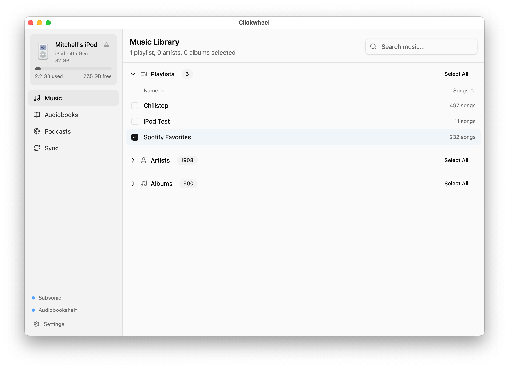

# Clickwheel

A desktop app for syncing music and audiobooks to classic iPods from self-hosted servers.

**Tested only on 4th generation monochrome iPods on macOS.**

## Features

- Sync music from any Subsonic-compatible server (Navidrome, Airsonic, etc.)
- Sync audiobooks and podcasts from Audiobookshelf with two-way playback position sync
- Transcodes audio as needed using embedded WASM ffmpeg 
- Restores iPods directly using Apple firmware, formatting as Windows
- Per-device sync configuration
- Config is stored on both the host and the iPod, reconciled on connect
- Browse the iPod's library and download music and playlists to your computer

## Screenshot

  <picture>
    <source
      srcset="assets/screenshot-dark.png"
      media="(prefers-color-scheme: dark)"
    >
    
  </picture>

## Requirements

- macOS (other platforms are implemented but untested)
- A clickwheel iPod
- A Subsonic-compatible server and/or Audiobookshelf instance

## Credits

The hard work of reverse-engineering the itunedb binary format, model detection, etc was done by [iOpenPod](https://github.com/XWBarton/iopenpod-plex) and ported to Go.

## Build

```sh
wails build
```

Or with the Makefile:

```sh
make build
```

## License

GPLv3
